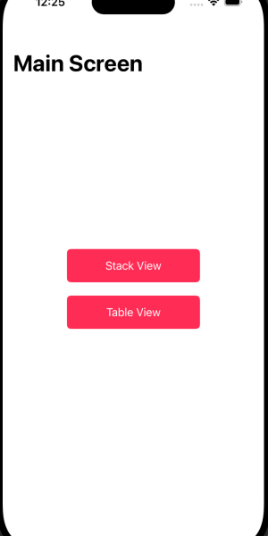
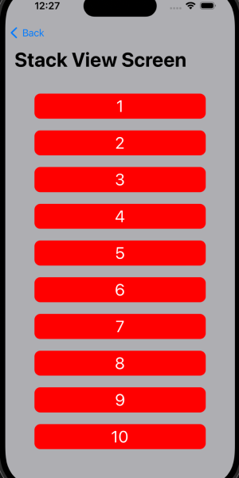
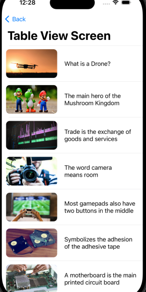

# UIKit-Samples

### About

Simple UIKit projects as samples and examples. See projects files in `Projects` folder.

## Navigate

- [TableView Content](#tabview-content)

## TableView Content

|Main Screen|StackView Screen|TableView Screen|
|:-:|:-:|:-:|
||||

### Logic

> Implemented 3 screens with base main screen with 2 buttons and navigation to Stack View Street and Table View Screen by tap on the corresponding button. 
> For Stack View Screen used hardcoded values of button count and values for button text.  
> Stack View Screen contains 10 buttons with equal filling on the screen.  
> Table View Screen contains 11 custom views with hardcoded images from left side and hardcoded text on the right side.  
> Table view cells are not clickable.  
> Implemented Back button functionality for each of the screens.  
